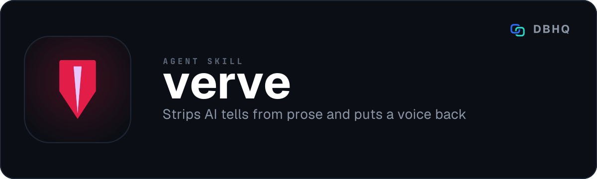

<div align="center">



# verve

**Is anyone recognisably behind this writing?**

[](LICENSE)
[](https://code.claude.com/docs/en/plugins)
[]()

A free, open-source tool by [DBHQ](https://dbhq.uk)

</div>

---

verve cuts the AI tells out of a piece of writing and puts a voice back into it, in **British English**, without changing what it says.

## What makes it different

**It does both halves.** Most de-slopping tools only subtract. Strip the tells and stop, and you get clean prose that still reads as machine-made - just blandly rather than floridly, because nothing is behind it. So the pattern sweep is followed by a voice pass: opinions, rhythm variance, specificity, acknowledged complexity, a bit of mess.

**Meaning is a veto, not a trade-off.** Every fact, number, name, date and citation survives unchanged; technical terms keep their exact wording; no invented statistics or examples. The result is scored on six dimensions, and fidelity below 9 forces a revision regardless of the total - because that failure is a changed meaning rather than a stylistic one. Aggressive rewriting tempts a model to compress three real points into one punchy line, and that is the failure this guards against.

**It knows when to do nothing.** Triage comes first. Text that already reads as human-written comes back unchanged with one line saying so. A tool that processes clean prose for the sake of processing it makes writing worse.

**It costs nothing to run.** The default engine is the conversation itself - no API key, no per-word billing, no network round trip. The optional Undetectable AI engine is there if you want a commercial second opinion, and the skill is explicit about when it has not been set up rather than silently falling back.

**British English throughout**, which is the point if you write for a UK audience and are tired of drafts drifting into American spelling.

## Install

### As a Claude Code plugin (recommended)

```
/plugin marketplace add dbhq-uk/marketplace
/plugin install verve@dbhq
```

### Local install (Claude Code or Codex)

```bash
git clone https://github.com/dbhq-uk/verve-skill.git
cd verve-skill
./install.sh          # Claude Code: symlinks into ~/.claude/skills (edits are live)
./install-codex.sh    # Codex: installs into ~/.codex/skills
```

[`install.sh`](install.sh) and [`install-codex.sh`](install-codex.sh) are the same install two ways: Claude Code substitutes `${CLAUDE_SKILL_DIR}` so the whole skill directory is symlinked untouched, while Codex does not, so its `SKILL.md` is rewritten at install time.

**Nothing to install beyond that.** The default engine needs no packages, no venv and no credentials.

## Usage

Ask in any session. Text comes from the message, a file, or the clipboard, and the options are plain language.

```
"verve this: [text]"
"verve draft.md"
"verve my clipboard"
"verve draft.md in a casual tone"
"verve draft.md with heavy rewriting"
"verve essay.md and explain what you changed"
"verve draft.md and save to output.md"
```

| Option | Values | Default |
|---|---|---|
| Tone | neutral, casual, professional, academic | neutral |
| Strength | light, moderate, heavy | moderate |
| Explain | on / off | off |
| Engine | claude, undetectable | claude |
| Output | conversation, save to file | conversation |

**Strength** is the dial worth knowing. *Light* touches only the unmistakable tells - banned words, em dashes, chatbot artefacts, sycophancy - and leaves sentence structure alone. *Moderate*, the default, adds rhythm and voice work. *Heavy* restructures freely and rewrites most sentences from scratch. The meaning constraints hold at every level, without exception.

## How it works

1. **Triage** - already-human text is returned unchanged rather than mangled
2. **Tone** - one of four presets, held throughout
3. **Pattern sweep** - five groups of tells (content, language, style, assistant artefacts, filler), each with before/after
4. **Voice pass** - put opinions, rhythm and specificity back, inside the tone
5. **Quick checks** - a 14-item pre-flight list run against the draft
6. **Score** - six dimensions, fidelity as a veto rather than an average

## The optional commercial engine

[Undetectable AI](https://undetectable.ai/develop) is a paid API, around $10/month. It is entirely optional and off by default:

```bash
./skills/verve/scripts/setup.sh
```

This provisions a virtualenv for `requests` and stores your key in `~/.verve/config.json` (permissions `600`), never in the repo. Then ask for *"verve draft.md using undetectable"*.

## Tests

```bash
cd skills/verve && python3 -m pytest tests/ -v
```

Offline - `requests` and `time.sleep` are both patched, so the polling-timeout case runs its 60 iterations instantly instead of taking five real minutes.

## Development

Want to hack on the skill or run it from source with live edits? See [`docs/dev-setup.md`](docs/dev-setup.md).

[`CONTRIBUTING.md`](CONTRIBUTING.md) covers working on it, and [`AGENTS.md`](AGENTS.md) is for an AI agent doing so. The skill itself is [`skills/verve/SKILL.md`](skills/verve/SKILL.md).

## Acknowledgements

Several patterns - false agency, vague declaratives, narrator-from-a-distance, meta-commentary, emphasis crutches, telling-instead-of-showing - and the idea of a scored exit gate come from [stop-slop](https://github.com/hardikpandya/stop-slop) by Hardik Pandya (MIT).

Renamed from `humanize` in July 2026. The skill still triggers on *"humanise this"* and *"make this sound human"*; only the name, the directory and the credentials path changed.

## License

[MIT](LICENSE) © 2026 DBHQ Consulting Ltd
